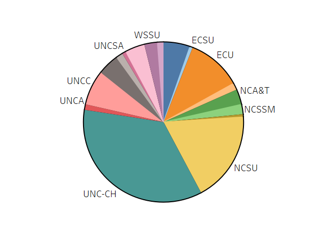
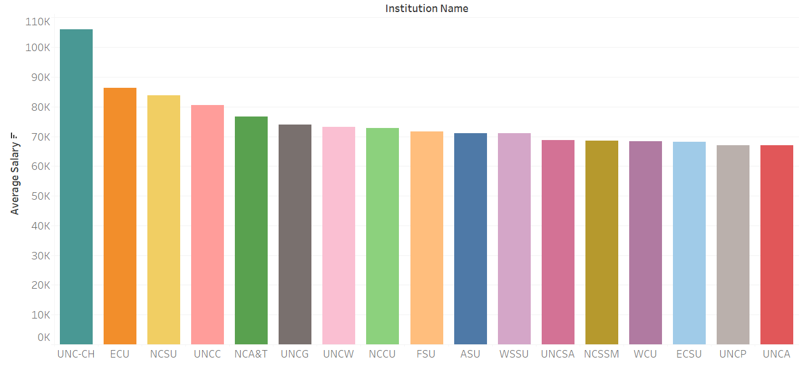
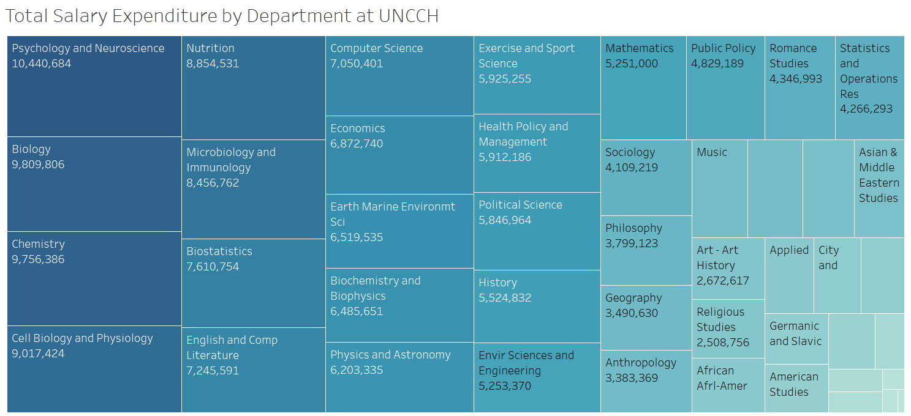
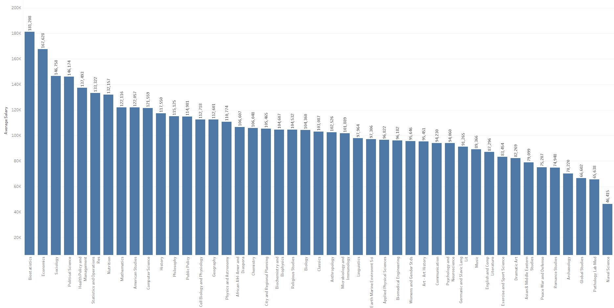
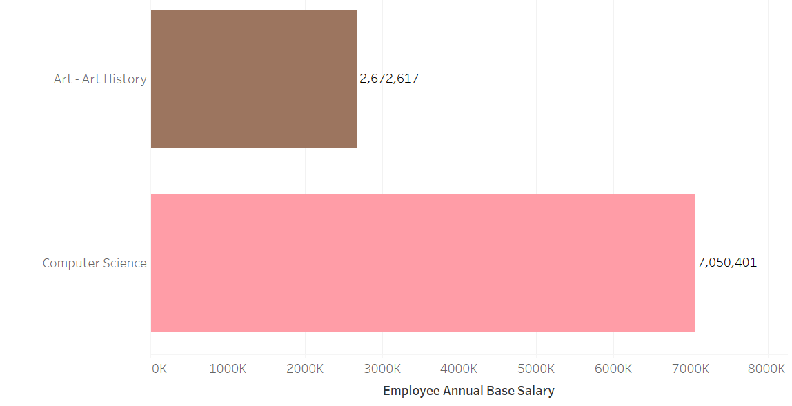
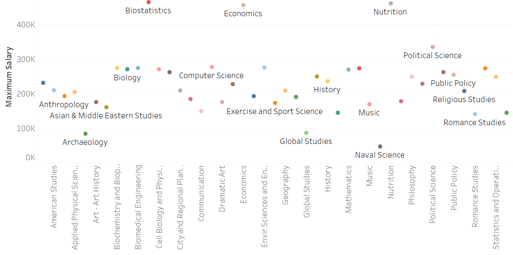
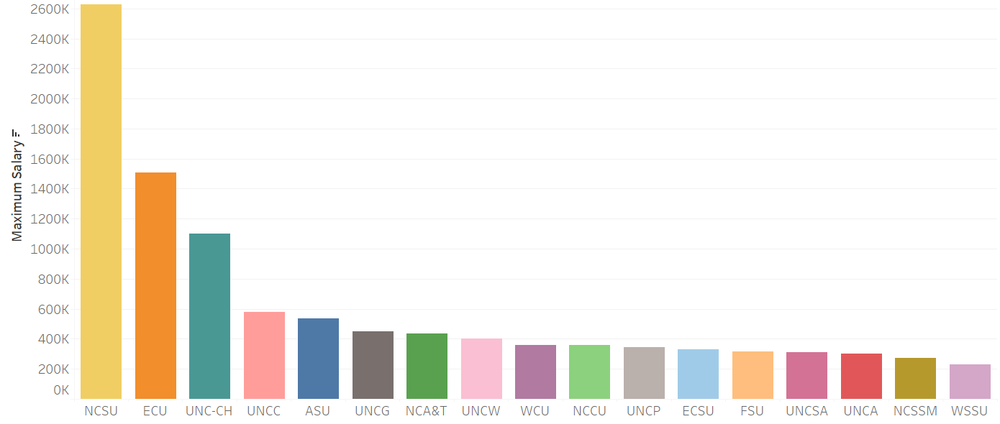

# Analysis of Salaries Across UNC System Schools
As a student who is majoring in both Computer Science and Studio Art, I have noticed differences in the way the departments are funded. I will analyze the disparity in university funding across departments primarily sourcing data from the [UNC System's salary database](https://uncdm.northcarolina.edu/salaries/index.php). 

This project will investigate where University funding comes from and ways it is distributed.

According to [The Well](https://www.unc.edu/discover/carolinas-money-where-we-get-it-how-we-spend-it/#:~:text=The%20University%20gets%20its%20funding,housing%2C%20dining%20and%20other%20services.) "the University gets its funding from a variety of places: research grants, tuition and fees, state appropriations, gifts, investment returns and income generated through housing, dining and other services." UNC spends over $3 billion in a year, and these various funding sources are used to pay salaries across departments within the university.

### [Average Salary Across UNC System Schools](https://public.tableau.com/views/TotalSalaryExpenditurebySchool/totalsalarybyschool?:language=en-US&publish=yes&:sid=&:display_count=n&:origin=viz_share_link)

This graph shows that UNC- Chapel Hill spends the most money on salaries, spending over $1.5 billion out of a total $4.2 billion accross all UNC System Schools.

### [Average Salary by School in UNC System](https://public.tableau.com/views/AverageSalarybySchool/avgsalarybyschool?:language=en-US&:sid=&:display_count=n&:origin=viz_share_link)

Even when averaging all salaries, UNC still spends more money per employee than other universities in the UNC system.

Let's take a closer look at how UNCCH's salaries are distributed.

### [Total Salary Expenditure by Department at UNC-CH](https://public.tableau.com/views/TotalSalaryExpenditurebyDepartmentatUNCCH/TotalSalaryExpenditure?:language=en-US&:sid=&:display_count=n&:origin=viz_share_link)

### [Average Salary across Departments at UNC-CH](https://public.tableau.com/views/UNCCHSalaryData/Sheet1?:language=en-US&:sid=&:display_count=n&:origin=viz_share_link)
This graph showcases the disparity in pay accross varying departments at UNC.

### [Total Salary Expenditure for Computer Science and Art Departments at UNC-CH](https://public.tableau.com/views/TotalSalaryExpenditureComputerScienceArtDepartments/Sheet3?:language=en-US&publish=yes&:sid=&:display_count=n&:origin=viz_share_link)

### [Maximum Salary across Departments at UNC-CH](https://public.tableau.com/views/MaximumSalaryforDepartmentsatUNCCH/AvgSalaryExpenditure?:language=en-US&publish=yes&:sid=&:display_count=n&:origin=viz_share_link)

### [Maximum Salary for each UNC System School](https://public.tableau.com/views/LargestSalaryforUNCSystemSchools/maxsalarybyschool?:language=en-US&publish=yes&:sid=&:display_count=n&:origin=viz_share_link)

